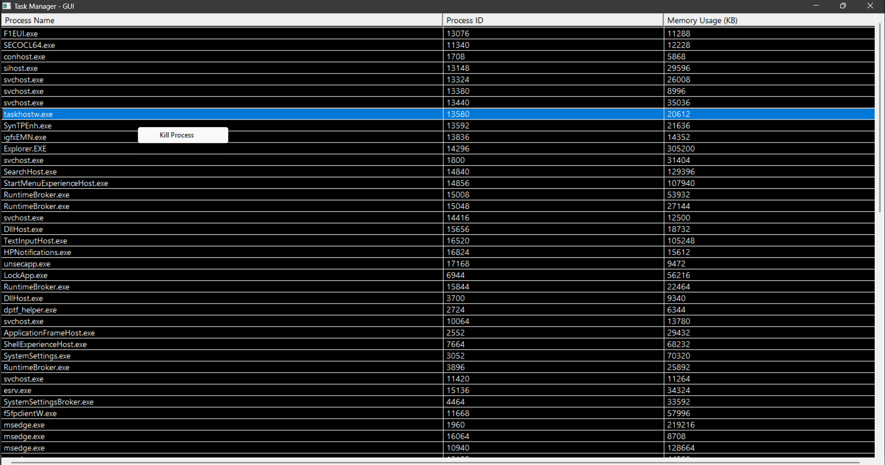
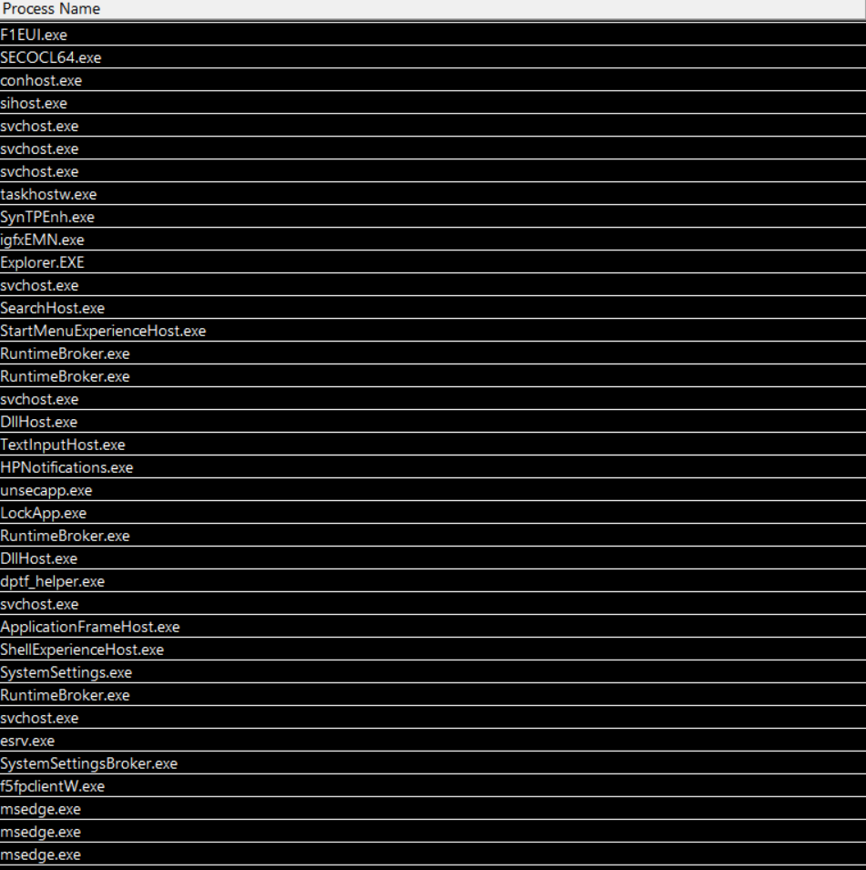

# 🖥️ Task Manager - GUI

|:----------------------------------------:|

> A modern and intuitive Windows-based Task Manager application, designed for real-time process monitoring and management.

---
## 📂 Project Structure
- **MainWindow.cpp**: Handles the main window creation and GUI interactions.
- **MainWindow.hpp**: Header file for `MainWindow.cpp` containing class declarations and function prototypes.
- **main.cpp**: Entry point of the application, initializes the main window and starts the application loop.
- **Task_Manager_Application.sln**: Visual Studio solution file to open the project.
- **Task_Manager_Application.vcxproj**: Project configuration file for Visual Studio.

## 🚀 Key Features
|  |
|:----------------------------------------:|
| **Real-Time Process List**: Displays running processes with details like name, ID, and memory usage. |

### 🗂️ Process Overview
- **Interactive UI**: Click on any process to view more details.
- **One-Click Termination**: Right-click on a process to access the "Kill Process" option.
- **Auto Refresh**: Keeps process data up-to-date with automatic refresh every 5 seconds.
- **Dark Theme**: Sleek design with black background and white text for easy readability.

---

## 🛠️ Technologies Used
- 💻 **C++**: Core logic and performance.
- 🖱️ **Win32 API**: Responsive and dynamic user interface.
- 🔄 **Multithreading**: Ensures real-time updates without UI lag.
- ⚙️ **System Programming**: Directly interacts with Windows process management.

### 📚 Useful Resources
- [Microsoft Win32 API Guide](https://learn.microsoft.com/en-us/windows/win32/) - Official documentation for the Win32 API, providing in-depth guidance on building Windows applications.

---

## 🎯 How to Get Started
1. **🔗 Clone the Repository**:
   ```bash
   git clone https://github.com/your-username/TaskManager-GUI.git


## 📞 Contact

**Your Name**

- Email: aditya28301@gmail.com
- LinkedIn: [aditya-darekar](https://www.linkedin.com/in/aditya-darekar-318a26143/)
- GitHub: [aditya28301](https://github.com/aditya28301)
